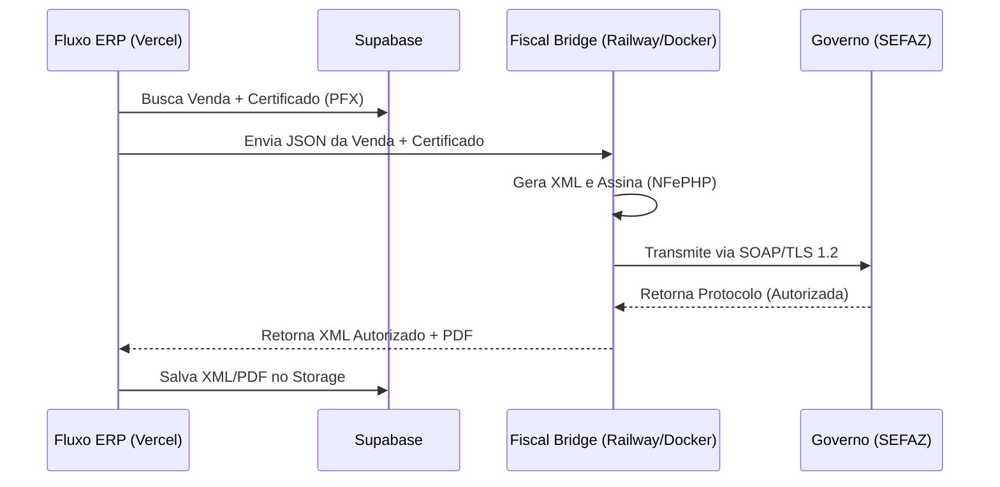

# Arquitetura Fiscal Open Source - Fluxo ERP

Este guia descreve como implementar a emissão de NFe com **custo zero de mensalidade**, utilizando a biblioteca **NFePHP** em um micro-serviço Dockerizado.

## 1. Visão Geral
O Fluxo ERP (Next.js) não processa a nota diretamente para evitar complexidade de infraestrutura. Ele utiliza uma "Ponte Fiscal" (Fiscal Bridge) que lida com a assinatura e transmissão SEFAZ.



## 2. Configuração do Micro-serviço (Railway)
O micro-serviço deve conter:
- **Linguagem:** PHP 8.2+
- **Bibliotecas:** `nfephp-org/nfephp`
- **Segurança:** Autenticação via `API_KEY` compartilhada entre Vercel e Railway.

### Dockerfile Base
```dockerfile
FROM php:8.2-apache
RUN apt-get update && apt-get install -y libxml2-dev libzip-dev openssl \
    && docker-php-ext-install soap zip
COPY --from=composer:latest /usr/bin/composer /usr/bin/composer
WORKDIR /var/www/html
RUN composer require nfephp-org/nfephp
```

## 3. Gestão de Certificados
- Os certificados `.pfx` dos clientes devem ser armazenados no **Supabase Storage** (Bucket: `certificados`, Privado).
- Senhas de certificado devem ser salvas de forma criptografada na tabela `public.empresas`.

## 4. Endpoints da Ponte (Sugestão)
- `POST /emitir-nfe`: Recebe dados da venda e retorna XML.
- `POST /cancelar-nfe`: Recebe chave e justificativa.
- `GET /status-sefaz`: Verifica se os servidores do governo estão online.

## 5. Regras de Negócio e Onboarding do Cliente

Para que a emissão seja funcional, o cliente (tenant) deve cumprir os seguintes pré-requisitos externos ao sistema:

1. **Certificado Digital A1 (.pfx):** O Fluxo ERP exige exclusivamente o modelo A1 para automação serverless. Certificados A3 (token físico) não são suportados.
2. **Credenciamento SEFAZ:** O CNPJ deve estar credenciado na SEFAZ do estado de origem para emissão via software de terceiros.
3. **Parâmetros Fiscais:** Regime Tributário (Simples Nacional, etc) e Alíquotas devem ser configurados no perfil da empresa.

### Estratégia de UX (Onboarding) e Posicionamento
Diferente de sistemas amadores que ocultam a necessidade de certificados, o Fluxo ERP adota a postura de grandes players do mercado (Conta Azul, Omie). A interface inclui um guia educativo (Tutorial Premium) para garantir que o usuário entenda que o Certificado A1 é o "combustível" necessário para a automação. 

**Justificativa Estratégica:**
- **Transparência:** Evita que o usuário tente emitir uma nota e receba um erro genérico sem saber o motivo.
- **Profissionalismo:** Orienta o usuário sobre ações externas obrigatórias (Compra de A1 e Credenciamento SEFAZ) que são padrão para qualquer ERP robusto no Brasil.
- **Acessibilidade:** A informação permanece disponível via componentes flutuantes, sem poluir o layout principal do PDV ou Histórico de Vendas.

## 6. Vantagens do Modelo
- **Custo:** R$ 0,00 (dentro dos limites gratuitos do Railway/Oracle Cloud).
- **Escalabilidade:** Um único micro-serviço PHP atende centenas de tenants do Fluxo ERP.
- **Independência:** Se você precisar trocar de linguagem no futuro, a lógica fiscal está isolada.

---
*Documento criado em 28/04/2026 para estratégia de redução de custos operacionais.*
